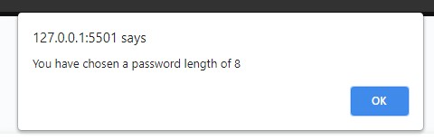

# Random Password Generator
UWA Web Dev Bootcamp - feb 2021

### https://github.com/Twistedmouse/Random-Password-Generator
### https://twistedmouse.github.io/Random-Password-Generator/

---
## The task at hand:
My task was basically to edit the code and create a password generator.   
I had to follow the following critira:

---
## Screenshots and Decription:
What i did:  
First stage for me was the research phase. I watched afew videos on youtube to get a rough idea on how password generators work.  
I also found this article about password generators https://www.studytonight.com/post/building-a-password-generator-with-javascript  
Which didnt follow all the aceptance criteria but helped me work out how it was ment to work. 
 
 
At first i made my generator with check boxxes but then re read the acceptance critera and nocticed it said to use prompts.  
I also did research on form elements  https://developer.mozilla.org/en-US/docs/Web/HTML/Element/form which i added. then realised towards the end   i didnt really need the form element but it was still good practice to learn.  
Next I read about input elements https://developer.mozilla.org/en-US/docs/Web/HTML/Element/input which was very importmant for my slider. 
 
The next step for me was to right some psuedo code to get an idea/plan of what i need to achieve.  

I then wrote my form elements and input in my HTML (even thought i didnt need the form elemenet)

I also went through the HTML to see what semantics I could change since it was all written with divs. 
Next I read about the lable element https://developer.mozilla.org/en-US/docs/Web/HTML/Element/label and use it for my slider.  
I also added a copy button but removed it since it wasnt apart of the critiea. 

I also changed the position of my slider to put it in the center. I decided to remove the numberbox next to the slider to make it feel even more random.  

So now i started going through and working on the javascript I started with trying to set up the arrays for the characters in the passphrase.  
But first I had to research concat https://developer.mozilla.org/en-US/docs/Web/JavaScript/Reference/Global_Objects/Array/concat.  
And I learnt about const to make my array constant variables.  
 
So I needed some varibles that were defined by arrays in the ascii table. I had to use concat for the Speical characters since they are all  
over the ascii table.  

I made a function to move through the ascii table so it didnt just read the array as two values 

HOT TIP!: I use consol.log throughout my javascript to make sure my arrays were working and pretty much to check if everything was working before making the button function.  

 
As you can see the arrays dont read as strings. So I need to lear how to make these values into string values.  

We were givin some code to work with already so i didnt need to make the onclick function or writepassword function. 
I noticed there was no gerneratePassword function but there was one in the writePassword function. 

So i added a generatePassword function.  
And that is were most of the javascript was written.

First I made if statements for my prompts.

 
this is how they appeard on the page: 

And finally i need a way for my characters to randomise then return the result.

with my randomiser i think if i had more time i would have added and else statement for if the password dosnt contain one of each character to then re-generate. but with my testing the probaility of nt getting one of each character even on the smaller slider numbers was very low.

I should also note my slider has a length variable to choose the length of the passphare.

I found it very interesting as well how the math.random for foor loop worked on the console: 

  And that is my Random Pasword Generator. thank you.
